# Expense Tracker Web

個人記帳網站：收支記錄、多帳戶（含外幣）、分類統計、預算追蹤、固定收支、資產淨值總覽。

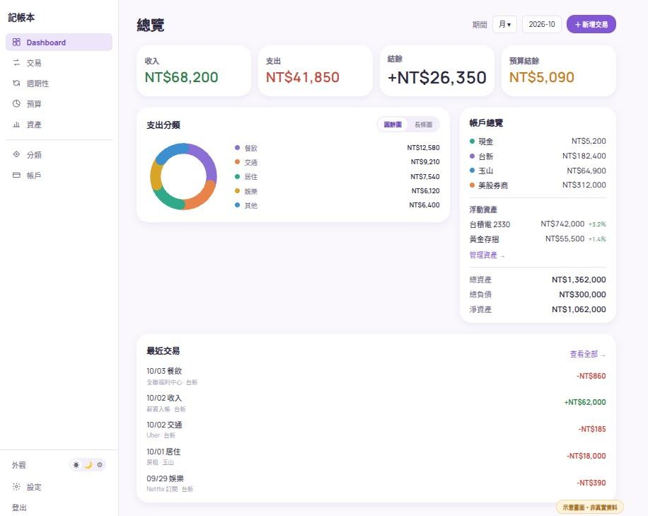

> 以下所有畫面皆依實際介面設計系統與各頁元件結構（`design-spec` tokens／`AppShell`／`CurvedCard`／
> `StatTile` 等）重繪的示意畫面，資料為示例、非真實帳務內容。

## 畫面預覽

### 桌機

| 交易 | 週期性交易 |
|---|---|
| 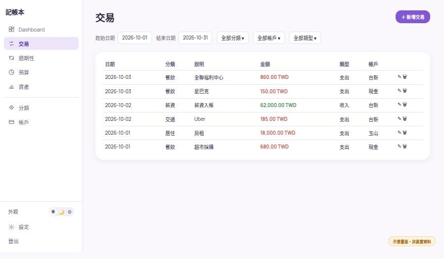 | 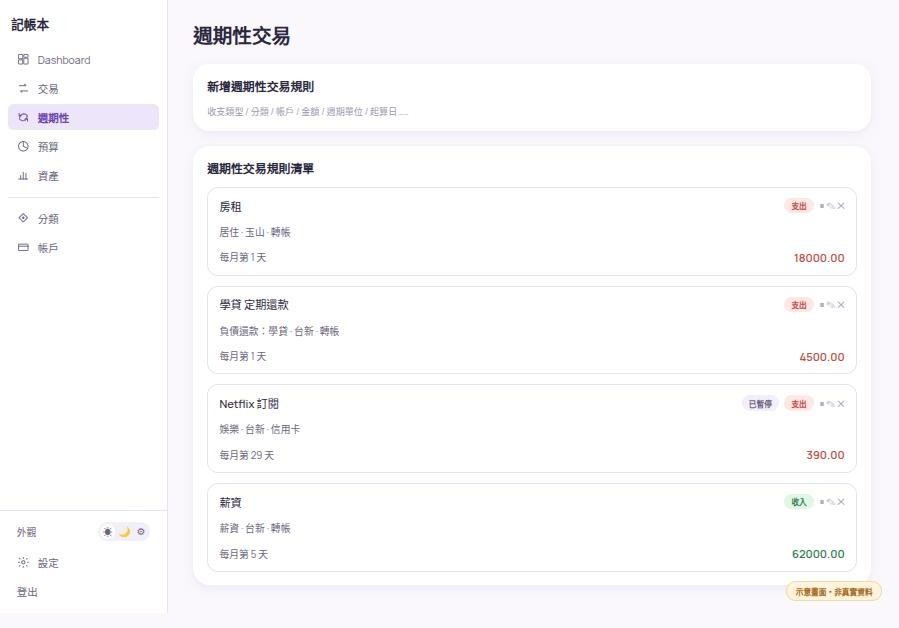 |

| 預算 | 資產 / 負債 |
|---|---|
| 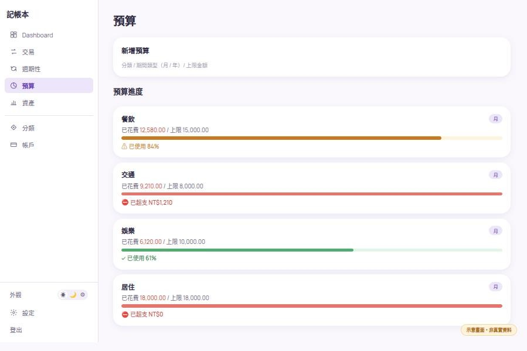 | 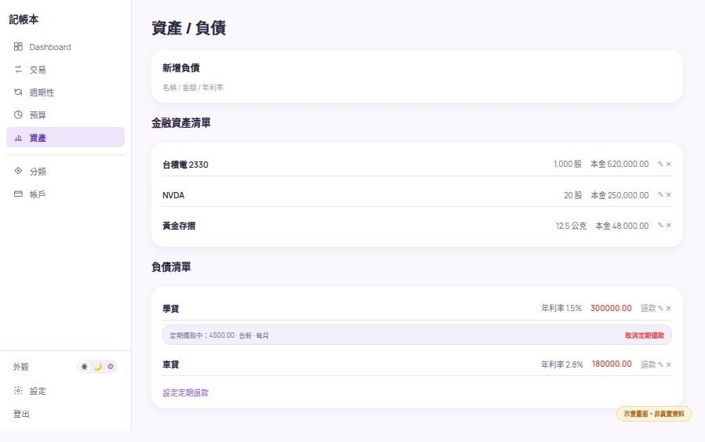 |

| 分類管理 | 帳戶管理 | 設定 |
|---|---|---|
|  | 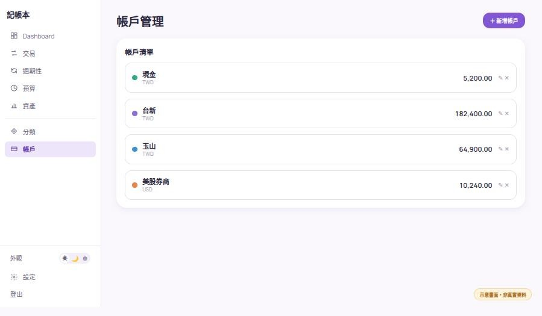 | 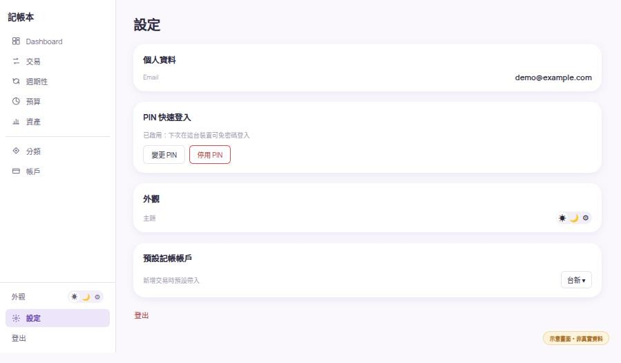 |

### 行動端

行動端為單欄堆疊 + 底部 5 格導覽（中央 FAB 快速新增交易），總覽的「結餘」卡在手機上會放大為 Hero 並置頂。

| 總覽 | 交易 | 週期性交易 | 預算 |
|---|---|---|---|
| 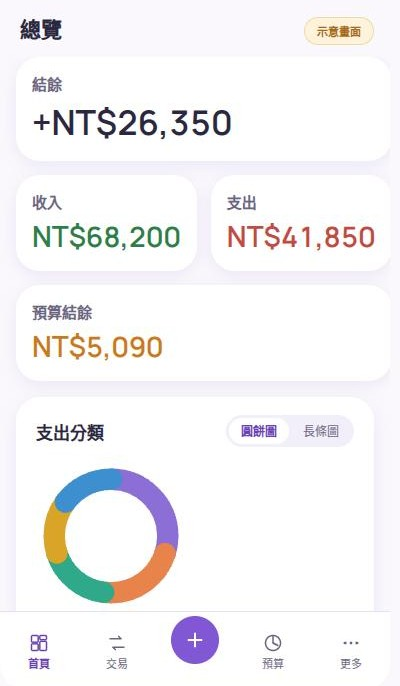 | 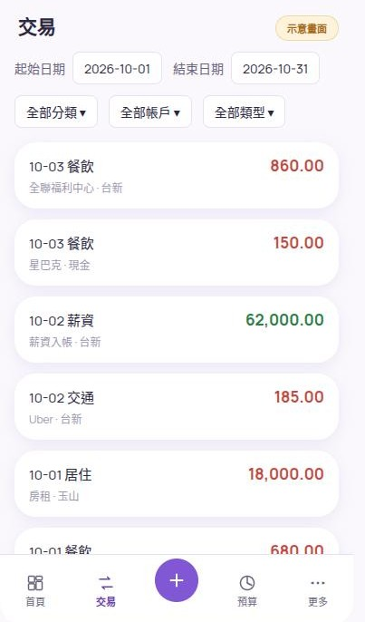 |  | 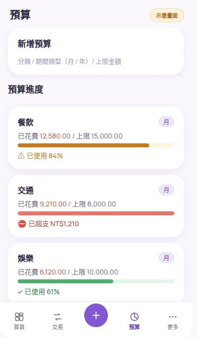 |

| 資產 / 負債 | 分類管理 | 帳戶管理 | 設定 |
|---|---|---|---|
| 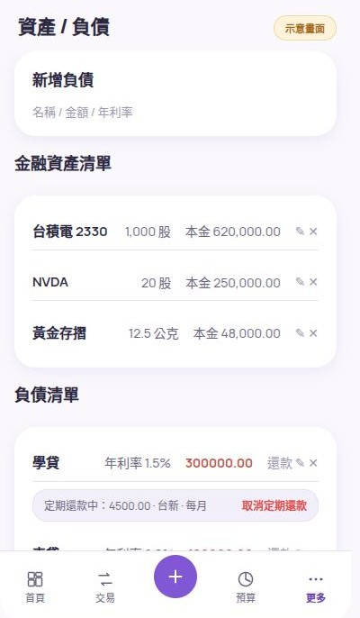 |  | 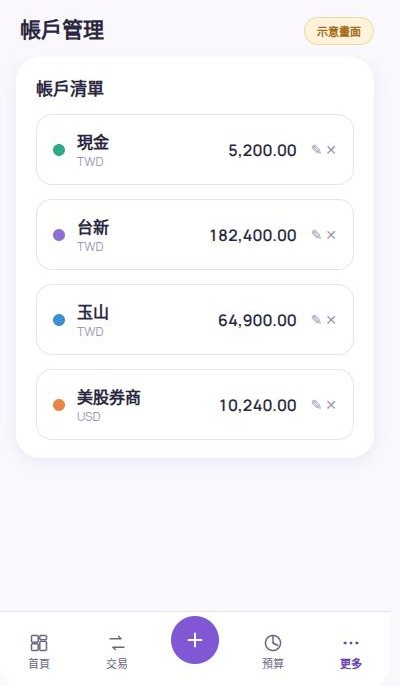 |  |

## 技術棧

- **前端**：Next.js 16（App Router）+ React 19 + TypeScript（strict）+ Redux Toolkit / RTK Query + Tailwind CSS v4
- **後端**：Python 3.14 + FastAPI + SQLAlchemy 2（async）+ Pydantic 2 + Alembic + uv
- **資料庫**：PostgreSQL 18（asyncpg）
- **快取**：Redis 8（報價/匯率快取、既有 session 相關用途）
- **執行環境**：Docker Compose（開發與正式環境共用同一份 compose，差異只在 env）

## 主要功能

- **多帳戶管理**：現金、銀行等帳戶，支援 10 種常見幣別（TWD/USD/JPY/EUR/CNY/HKD/GBP/AUD/KRW/THB），
  建立後幣別不可變更
- **收支記錄**：新增/編輯/刪除交易，分類管理，支援固定週期收支（週/月/年）自動產生交易
- **帳戶互轉**：雙分錄記帳，轉帳不計入當月收支；跨幣別轉帳自動以即時匯率換算轉入金額
- **預算追蹤**：依分類設定月度預算上限，即時顯示剩餘額度（跨幣別支出自動換算成 TWD 計算）
- **資產總覽**：股票、貴金屬等浮動資產報價（TWSE、Yahoo Finance、gold-api），外幣帳戶餘額即時
  換算成 TWD 計入總資產/淨資產
- **負債管理**：登記負債金額與利率，支援一次性還款與設定定期還款（到期自動產生支出交易並
  減少負債餘額，還清自動歸檔）
- **統計分析**：分類圓餅圖/長條圖、收支趨勢線圖、日/週/月/年區間彙總
- **帳號安全**：Email + 密碼登入，支援 PIN 快速登入

## 本地開發

需求：Docker + Docker Compose（宿主機不需另裝 Python / Node，前後端都在容器內執行）。

```bash
# 複製環境變數範本並依需求調整（機密值請自行填寫，勿沿用範例值）
cp .env.development.example .env

# 啟動（背景執行，含資料庫 migration）
docker compose up -d --build
docker compose exec backend alembic upgrade head

# 開發時持續監看檔案變更並自動重建
docker compose watch
```

啟動後：前端 http://localhost:3000，後端 API http://localhost:8000/api/v1（Swagger 文件在
`/api/docs`）。

### 常用指令

```bash
# 停止服務
docker compose stop

# 後端 lint / type check / 測試
docker compose exec backend sh -c "uv run ruff check . && uv run ruff format --check . && uv run mypy app && uv run pytest"

# 前端 lint / type check / 測試 / build
docker compose exec frontend sh -c "npm run lint && npm run typecheck && npm run test -- --run && npm run build"

# 新增 Alembic migration
docker compose exec backend alembic revision -m "描述"
```

## 部署到正式環境

需求：一台裝了 Docker + Docker Compose 的伺服器（Linux）。

```bash
# 1. 下載原始碼
git clone https://github.com/oilotaku/expense-tracker-web.git
cd expense-tracker-web

# 2. 建立正式環境變數（機密值必須現場產生，勿沿用範例值或沿用開發環境的 .env）
cp .env.production.example .env
# 手動編輯 .env：
#   - POSTGRES_PASSWORD / JWT_SECRET_KEY：openssl rand -hex 32 產生
#   - DATABASE_URL 裡的密碼要跟 POSTGRES_PASSWORD 一致
#   - CORS_ORIGINS / NEXT_PUBLIC_API_URL：改成實際對外網域（https://...）

# 3. 建置並在背景啟動
docker compose up -d --build

# 4. 套用資料庫 migration（每次部署新版本都要重跑一次）
docker compose exec backend alembic upgrade head

# 5. 確認服務健康
docker compose ps
curl http://localhost:8000/api/v1/health
```

`APP_ENV=production` 會自動關閉 `/api/docs`、`/api/openapi.json`；正式環境**不要**額外跑
`docker compose watch`（那是開發用的檔案監看自動重建）。對外網域建議在前面加一層反向代理
（Nginx / Caddy）處理 TLS 與網域轉發，本 repo 未內建。

### 排程設定（週期性交易 / 負債定期還款）

一般收支的週期性交易與負債定期還款都需要**每日至少觸發一次** `POST /internal/recurring/run`
才會實際產生交易；這支 API 本身不會自動被呼叫，比照本專案排程慣例（host 端 cron / systemd
timer，不經 CI），部署主機上需另外設定：

```bash
# systemd timer（建議）：
# /etc/systemd/system/expense-tracker-recurring.service
[Unit]
Description=Expense Tracker: trigger recurring transaction generation

[Service]
Type=oneshot
ExecStart=/usr/bin/curl -fsS -X POST http://localhost:8000/api/v1/internal/recurring/run \
  -H "X-Internal-Secret: ${INTERNAL_TRIGGER_SECRET}"

# /etc/systemd/system/expense-tracker-recurring.timer
[Unit]
Description=Daily trigger for expense-tracker recurring transactions

[Timer]
OnCalendar=*-*-* 01:00:00
Persistent=true

[Install]
WantedBy=timers.target
```

```bash
systemctl daemon-reload
systemctl enable --now expense-tracker-recurring.timer
```

`INTERNAL_TRIGGER_SECRET` 取 `.env` 裡的值（`openssl rand -hex 32` 產生，**不可**沿用
`.env.*.example` 的佔位字串，非 development 環境沿用預設值會啟動失敗）。也可以改用傳統 cron
達到同樣效果（`0 1 * * * curl ...`），效果等價，本 repo 沒有強制指定工具。

### 更新既有部署

```bash
git pull
docker compose up -d --build
docker compose exec backend alembic upgrade head
```

## 專案結構

```
.
├── backend/            # FastAPI 應用（app/、alembic/、tests/）
├── frontend/            # Next.js 應用（src/app/、src/components/、src/lib/）
├── docs/
│   ├── Arch/           # 架構決策紀錄（ADR）與長期方向
│   ├── Rules/          # 專案級開發規則（只能比 harness 規則更嚴）
│   └── Tasks/          # 各版本規劃（propose）與實作進度（tasks / fixed）
├── docker-compose.yml
└── AGENTS.md / CLAUDE.md   # AI 協作開發規範
```

## 文件導航

- [架構決策](./docs/Arch/README.md)
- [開發規則](./docs/Rules/README.md)
- [版本任務與進度](./docs/Tasks/README.md)

## 授權

僅供個人使用，未開放授權。
